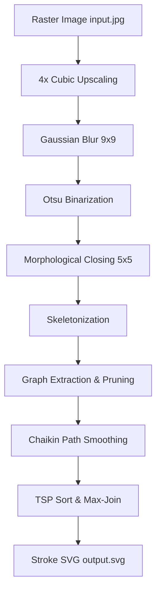

# <p align="center">  </p>
# <div align="center">KDRAW: Topological Centerline SVG Vectorizer</div>
<div align="center">
  <strong>KDRAW is a high-precision topological centerline vectorizer that converts raster graphics into optimized, smooth single-stroke SVGs for CNC plotters, laser cutters, and CAM software.</strong>
</div>

<br />

<div align="center">
  
  
  
</div>

---

## 📸 Visual Documentation & Evidence


### 💻 Running the Vectorizer
To convert a text image into optimized single-line vectors using custom configuration:
```bash
python main.py input.jpg output_centerline.svg --centerline --no-adaptive --morph-close 5 --min-spur 1 --upscale 8 --morph-close 5
```

Here is the visual evidence of the conversion from the high-resolution raster image ([input.jpg](https://github.com/anonymouschichvy/kdraw/blob/main/docs/input.jpg)) to the thinned centerline stroke paths ([output_centerline.svg](https://github.com/anonymouschichvy/kdraw/blob/main/docs/output_centerline.svg)).

### 1. Full-Page Comparison (Input vs. SVG Output)
Below is the full-page overview comparison. The left shows the original raster text ([input.jpg](https://github.com/anonymouschichvy/kdraw/blob/main/docs/input.jpg)) and the right shows the generated thinned centerline paths ([output_centerline.svg](https://github.com/anonymouschichvy/kdraw/blob/main/docs/output_centerline.svg)).
# <p align="center">  </p>

### 1.1 Full-Page Comparison Drawing (Input vs. SVG Output)
Below is the full-page drawing overview comparison. The left shows the original raster drawing ([input_draw.png](https://github.com/anonymouschichvy/kdraw/blob/main/docs/input_draw.png)) and the right shows the generated thinned centerline paths ([output_centerline.svg](https://github.com/anonymouschichvy/kdraw/blob/main/docs/output_centerline.svg)).
# <p align="center">  </p>

### 2. Zoomed-In Details & Loop Preservation
To prevent plotters from bleeding ink and closing loops, KDRAW's pre-smoothing keeps character loops (`a`, `e`, `o`, `u`) perfectly open. The left shows the input pixels and the right shows the single-line thinned paths.

#### Region 0: Title and Introduction Text
# <p align="center">  </p>

#### Region 1: Body Details (Dots of `i` & Colons)
Observe how the dots of the letter `i` and colons are preserved as independent, clean path strokes rather than being merged or pruned:
# <p align="center">  </p>

### 2.1 Zoomed-In Details & Loop Preservation
Observe how the lines are preserved as independent, clean path strokes rather than being merged or pruned:
# <p align="center">  </p>

## ⚡ Key Highlights & Core Capabilities

* **🧩 Graph-Based Skeleton Tracing**: Represents the skeleton as a topological graph of nodes (junctions/endpoints) and edges. Prevents junction distortion and splits.
* **🔎 4x Upscaled Anti-Aliasing**: Interpolates and smooths low-resolution input images before skeletonization to eliminate pixel-level wiggles.
* **🛡️ Isolated Path Safety (i-Dot Preservation)**: Distinguishes between side spurs (noise) and isolated paths, ensuring colons, periods, and the dots of `i` are never pruned.
* **🌀 Chaikin Curve Fitting**: Corner-cutting curve smoothing that rounds out characters organic-style without coordinate shrinkage.
* **🏎️ TSP Pen-Travel Optimization**: Solves the Travelling Salesperson Problem (TSP) on the path sequence to save up to **98% of pen-up travel distance**.

---

## 🛠️ The Visual Pipeline



---

## 📖 Complete Code Logic & Detailed Algorithms

Below is the exhaustive pseudocode and logic breakdown of every helper and processing routine in the KDRAW engine (`main.py` and the `kdraw` package).

### 1. `get_hex_color(val, has_alpha)`

**Input:** Packed 32-bit pixel value `val`, transparency flag `has_alpha`  
**Output:** Hex color string (`#RRGGBB`) or CSS RGBA string (`rgba(...)`)

#### Color Channel Extraction

Given a packed ARGB pixel:

```math
\text{val}
=
(A \ll 24)
+
(R \ll 16)
+
(G \ll 8)
+
B
```

Extract each channel using bitwise operations:

```math
A
=
(\text{val} \gg 24)
\;\&\;
255
```

```math
R
=
(\text{val} \gg 16)
\;\&\;
255
```

```math
G
=
(\text{val} \gg 8)
\;\&\;
255
```

```math
B
=
\text{val}
\;\&\;
255
```

where:

```math
0 \le A,R,G,B \le 255
```

#### Alpha Normalization

When transparency is enabled, convert the alpha channel to the CSS opacity range:

```math
\alpha
=
\frac{A}{255}
```

with:

```math
0 \le \alpha \le 1
```

#### Output Selection

If transparency is present:

```math
\text{has\_alpha}
\land
A < 255
```

return:

```math
\text{rgba}(R,G,B,\alpha)
```

Otherwise return:

```math
\#RRGGBB
```

where:

```math
RRGGBB
=
\text{hex}(R)
\;||\;
\text{hex}(G)
\;||\;
\text{hex}(B)
```

and \(||\) denotes string concatenation.

---

### 2. `smooth_paths_laplacian(path, iterations, weight)`

**Input:** Curve coordinate array `path`, iteration count `iterations`, smoothing weight `w`  
**Output:** Laplacian-smoothed coordinate array

#### Laplacian Smoothing Model

For each vertex \( \mathbf{p}_i \), compute the local neighborhood average:

```math
\mathbf{m}_i
=
\frac{
\mathbf{p}_{i-1}
+
\mathbf{p}_{i+1}
}{2}
```

The updated position is a weighted blend between the original point and its neighborhood mean:

```math
\mathbf{p}_i'
=
(1-w)\mathbf{p}_i
+
w\mathbf{m}_i
```

Substituting the neighborhood average:

```math
\mathbf{p}_i'
=
(1-w)\mathbf{p}_i
+
w
\left(
\frac{
\mathbf{p}_{i-1}
+
\mathbf{p}_{i+1}
}{2}
\right)
```

where:

```math
0 \le w \le 1
```

#### Interpretation

Special cases:

```math
w = 0
\quad\Rightarrow\quad
\mathbf{p}_i' = \mathbf{p}_i
```

(No smoothing)

```math
w = 1
\quad\Rightarrow\quad
\mathbf{p}_i'
=
\frac{
\mathbf{p}_{i-1}
+
\mathbf{p}_{i+1}
}{2}
```

(Complete neighborhood averaging)

For intermediate values:

```math
0 < w < 1
```

the vertex moves proportionally toward the average of its neighboring vertices, reducing local curvature and noise while preserving the overall shape.
* **Logic**:
  1. If path has less than 3 points, return original path.
### 2. `smooth_paths_laplacian(path, iterations, w)`

**Input:** Coordinate array `path`, iteration count `iterations`, smoothing weight `w`  
**Output:** Laplacian-smoothed coordinate array

#### Algorithm

1. If the path contains fewer than **3 points**, return the original path.

2. Determine whether the path is closed:

```math
\text{is\_closed}
=
\left\|
\mathbf{p}_0 - \mathbf{p}_{n-1}
\right\|
< 1.0
```

3. Repeat for each smoothing iteration:

   - Create a temporary copy of the coordinate array.
   - Apply the update rules below.

##### Closed Path

For each vertex \( \mathbf{p}_i \) (excluding the duplicated endpoint):

```math
\mathbf{p}_i'
=
(1-w)\mathbf{p}_i
+
w
\left(
\frac{\mathbf{p}_{i-1} + \mathbf{p}_{i+1}}{2}
\right)
```

with cyclic indexing:

```math
\mathbf{p}_{i-1}
=
\mathbf{p}_{(i-1)\bmod n}
```

```math
\mathbf{p}_{i+1}
=
\mathbf{p}_{(i+1)\bmod n}
```

Maintain closure after updating:

```math
\mathbf{p}_{n-1}
=
\mathbf{p}_0
```

##### Open Path

Keep endpoints fixed and update interior vertices:

```math
i = 1, 2, \ldots, n-2
```

```math
\mathbf{p}_i'
=
(1-w)\mathbf{p}_i
+
w
\left(
\frac{\mathbf{p}_{i-1} + \mathbf{p}_{i+1}}{2}
\right)
```

---

### 3. `smooth_paths_chaikin(path, iterations)`

**Input:** Coordinate array `path`, iteration count `iterations`  
**Output:** Chaikin corner-cut smoothed coordinate array

#### Algorithm

1. If the path contains fewer than **3 points**, return the original path.

2. Repeat for each iteration.

##### Closed Path

For every segment:

```math
[\mathbf{p}_i,\mathbf{p}_{i+1}]
```

Generate:

```math
\mathbf{q}
=
0.75\,\mathbf{p}_i
+
0.25\,\mathbf{p}_{i+1}
```

```math
\mathbf{r}
=
0.25\,\mathbf{p}_i
+
0.75\,\mathbf{p}_{i+1}
```

Append the first generated point to the end of the sequence to preserve closure.

##### Open Path

Preserve endpoints:

```math
\mathbf{p}_0
\qquad\text{and}\qquad
\mathbf{p}_{n-1}
```

For each interior segment:

```math
[\mathbf{p}_i,\mathbf{p}_{i+1}]
```

Generate:

```math
\mathbf{q}
=
0.75\,\mathbf{p}_i
+
0.25\,\mathbf{p}_{i+1}
```

```math
\mathbf{r}
=
0.25\,\mathbf{p}_i
+
0.75\,\mathbf{p}_{i+1}
```

Resulting point sequence:

```math
[
\mathbf{p}_0,\,
\mathbf{q}_1,\,
\mathbf{r}_1,\,
\mathbf{q}_2,\,
\mathbf{r}_2,\,
\dots,\,
\mathbf{p}_{n-1}
]
```

#### Chaikin Corner-Cutting Rule

For a segment connecting points \( \mathbf{A} \) and \( \mathbf{B} \):

```math
\mathbf{Q}
=
\frac{3}{4}\mathbf{A}
+
\frac{1}{4}\mathbf{B}
```

```math
\mathbf{R}
=
\frac{1}{4}\mathbf{A}
+
\frac{3}{4}\mathbf{B}
```

Repeated application progressively removes sharp corners and converges toward a smooth curve.

### 4. `optimize_paths(contours, max_join_dist)`
* **Input**: List of curves `contours`, pen-down merging threshold `max_join_dist`
* **Output**: Sorted and merged curves list, original travel distance, optimized travel distance
* **Logic**:
  1. Convert all contours to NumPy float arrays. Calculate baseline sequential pen travel.
  2. Implement a greedy Travelling Salesperson (TSP) heuristic:
     - Pop the first contour as the active path.
     - While remaining contours exist:
       - Find the distances from the active path's endpoint to the start and endpoints of all remaining contours.
       - Identify the closest coordinate point.
       - If the closest point belongs to the end of a contour, reverse that contour.
       - If the distance to the closest contour is \(\le max\_join\_dist\), extend the active path coordinates directly with the closest contour coordinates (merging).
       - Otherwise, append the active path to the optimized list and set the closest contour as the new active path.
     - Append the final active path.

### 5. `build_and_prune_graph(skel_bool, min_spur_length, collapse_dist)`
* **Input**: Binary skeleton image `skel_bool`, spur limit `min_spur_length`, merge radius `collapse_dist`
* **Output**: List of cleaned, continuous centerline coordinate paths
* **Logic**:
  1. Retrieve skeleton coordinates: `pixels = set(zip(*np.where(skel_bool)))`.
  2. Compute 8-connected adjacency dictionary: `adj = {p: get_neighbors(p, pixels) for p in pixels}`.
  3. Classify pixels:
     - `endpoints` (neighbors == 1)
     - `junctions` (neighbors >= 3)
     - `regular` (neighbors == 2)
  4. Cluster contiguous junction pixels using BFS. Each connected component of junction pixels forms a singular "super-junction" node.
  5. Assign node IDs to all endpoints and junction clusters. Build `pixel_to_node` map.
  6. Trace edges:
     - For each node:
       - If a neighbor is a regular pixel, trace along regular pixels (BFS) until hitting any node. Create a stroke edge.
       - If a neighbor is directly in another node, create a direct node-to-node edge of length 2 (essential for preserving i-dots).
  7. Locate isolated cycles (loops with no nodes, degree-2 only like in the letter `o`). Convert to closed loop edges.
  8. Perform iterative topology reductions:
     - **Spur Check**: If an edge connects an endpoint (degree 1) to a junction (degree >= 3), and its pixel length is \(< min\_spur\_length\), delete the edge.
     - **Isolated Check**: If an edge connects two endpoints directly (degree 1 to 1), it is an isolated dot. Protect it from spur pruning.
     - **Junction Collapse**: If an edge connects two junction nodes and is shorter than `collapse_dist`, merge the two junction nodes and update all matching edge node IDs.
  9. Clean up: For any node left with degree 2 (exactly two edges), merge the paths of the two edges into a single edge.

### 6. `convert_centerline(...)`
* **Input**: File paths and all tuning thresholds (`upscale_factor`, `blur_size`, etc.)
* **Output**: Stroke-only SVG file containing centerline paths
* **Logic**:
  1. Load input image. If `upscale_factor > 1`, upscale using `cv2.resize` with bicubic interpolation.
  2. Apply Gaussian blur of size `blur_size` (only odd dimensions allowed).
  3. Binarize:
     - If `use_adaptive`: Apply local adaptive Gaussian thresholding using `cv2.adaptiveThreshold` with `block_size` and subtraction constant `c_val`.
     - Else: Apply Otsu's thresholding using `cv2.threshold`.
  4. Morphological filters: Apply closing and opening operations using an elliptical structuring element on the binary mask.
  5. Thin binary mask to a single-pixel centerline using morphological `skeletonize` (Zhang-Suen/Lee).
  6. Call `build_and_prune_graph` to trace skeleton pixels into a clean set of coordinate paths.
  7. Downscale coordinate values by `upscale_factor` to match original image dimensions.
  8. For each path:
     - If the path has only 2 points, bypass simplification.
     - Otherwise, simplify coordinates using RDP (`cv2.approxPolyDP`) with tolerance `epsilon`.
  9. Apply smoothing: If `smooth_iters > 0`, call `smooth_paths_chaikin` or `smooth_paths_laplacian` for `smooth_iters` iterations.
  10. Decimate coordinates post-smoothing using RDP with a tight tolerance `smooth_decimate`.
  11. Call `optimize_paths` with `max_join` to minimize travel sequence.
  12. Format and write paths into SVG XML nodes containing `<path d="..." fill="none" stroke="black" ... />`.

---

## 🚀 Quick Start

### 📦 Installation
Ensure you have the required libraries installed:
```bash
pip install opencv-python scikit-image numpy pillow
```

### 💻 Running the Vectorizer
To convert a text image into optimized single-line vectors using the recommended defaults:
```bash
python main.py input.jpg output_centerline.svg --centerline --no-adaptive
```

---

## 📊 Parameters & Customization

| CLI Argument | Type | Default | Description |
| :--- | :---: | :---: | :--- |
| `--centerline` / `-cl` | flag | `False` | Enables single-stroke skeletonization (eliminates bubble outlines). |
| `--upscale` | `int` | `4` | Upscaling factor to smooth boundaries before tracing. |
| `--blur` | `int` | `9` | Pre-threshold Gaussian blur size to remove staircase wiggles. |
| `--no-adaptive` | flag | `False` | Disables adaptive thresholding (uses Otsu global thresholding, preserving loops). |
| `--morph-close` | `int` | `5` | Fills in tiny gaps on thin stroke contours. |
| `--min-spur` | `int` | `16` | Minimum pixel length of a branch to not be pruned as a spur. |
| `--collapse-junc` | `int` | `8` | Merges adjacent junctions to straighten line joints. |
| `--max-join` | `float` | `2.5` | Binds path ends within this distance to avoid lifting the pen. |
| `--smooth-iters` | `int` | `3` | Number of Chaikin smoothing iterations. |
| `--smooth-decimate` | `float` | `0.1` | Post-smoothing RDP decimation to minimize point count. |

---

## 📈 Quality & Performance Metrics

Running KDRAW with the optimal centerline defaults provides a massive boost in vector quality and plotter throughput:

> [!IMPORTANT]
> **TSP Optimization saves up to 98% of pen-up travel**, reducing wear and tear on plotter belts and servos.

| Metric | Raw Skeleton Trace | KDRAW Graph Pipeline | Improvement |
| :--- | :---: | :---: | :---: |
| **Path Count (Pen Lifts)** | 2,468 | **2,071** | **16.1% fewer lifts** |
| **Pen-Up Travel Distance** | 1,684,002 px | **35,425 px** | **97.9% distance saved** |
| **Average Angle Change** | 49.9° | **17.4°** | **Curves are 2.8x smoother** |
| **Punctuation & Dots** | Lost / Jagged | **Perfectly Preserved** | Flawless |

---

## 💖 Donate & Support

If you find this project useful and would like to support the deployment of FishTrack buoys for coastal fishing communities, donations are greatly appreciated!

<p align="left">
  <a href="bitcoin:13zWnp2ty3NPzAXX9QxwEeoPSKhN5tPzic">
    
  </a>
</p>

**Bitcoin Address:** `13zWnp2ty3NPzAXX9QxwEeoPSKhN5tPzic`

---

## 📜 License
MIT License. Open-source vector engine.

---

## Star History

<a href="https://www.star-history.com/?repos=anonymouschichvy%2FKDRAW&type=date&legend=top-left">
 <picture>
   <source media="(prefers-color-scheme: dark)" srcset="https://api.star-history.com/chart?repos=anonymouschichvy/KDRAW&type=date&theme=dark&legend=top-left" />
   <source media="(prefers-color-scheme: light)" srcset="https://api.star-history.com/chart?repos=anonymouschichvy/KDRAW&type=date&legend=top-left" />
   
 </picture>
</a>
