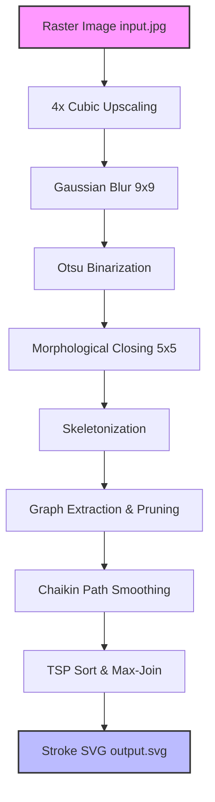

# 🎛️ KDRAW: Topological Centerline SVG Vectorizer

```
    __  ______  ____  ___ _      __
   / / / / __ \/ __ \/   | | /| / /
  / /_/ / / / / /_/ / /| | |/ |/ / 
 / __  / /_/ / _, _/ ___ | |/|/ /  
/_/ /_/\____/_/ |_/_/  |_|__/|__/   
                                   
  Topological Skeleton Tracing & Curve Smoothing for CNC Plotters
```

---

## 🎨 Standalone Vector Engine
**KDRAW** is a high-precision standalone vector engine designed for CNC plotters, laser cutters, and CAM software. When translating text or hand-drawn schematics into physical map plots, conventional outline tracing causes double-stroke "bubble letters" that bleed and ruin the final output. 

KDRAW resolves this by extracting **single-stroke centerlines** using morphological skeletonization and graph topology. It optimizes path layouts to eliminate mechanical jitter, smooth pixelation wiggles, and reduce pen-up plotting travel.

---

## ⚡ Key Features

* **🧩 Graph-Based Skeleton Tracing**: Represents the skeleton as a topological graph of nodes (junctions/endpoints) and edges. Prevents junction distortion and splits.
* **🔎 4x Upscaled Anti-Aliasing**: Interpolates and smooths low-resolution input images before skeletonization to eliminate pixel-level wiggles.
* **🛡️ Isolated Path Safety (i-Dot Preservation)**: Distinguishes between side spurs (noise) and isolated paths, ensuring colons, periods, and the dots of `i` are never pruned.
* **🌀 Chaikin Subdivision**: Corner-cutting curve smoothing that rounds out characters organic-style without coordinate shrinkage.
* **🏎️ TSP Pen-Travel Optimization**: Solves the Travelling Salesperson Problem (TSP) on the path sequence to save up to **98% of pen-up travel distance**.

---

## 🧠 Detailed Algorithm Breakdown

KDRAW's core engine processes image vectors through a four-phase mathematical pipeline:

### 1. High-Resolution Preprocessing & Binarization
To solve the discretization noise (which causes wiggles and spurious branches), KDRAW uses sub-pixel boundary smoothing:
1. **upscale_factor (4x)**: Interpolates the grayscale image using a cubic kernel:
   \[
   f(x,y) = \sum_{i=0}^3 \sum_{j=0}^3 a_{ij} x^i y^j
   \]
2. **blur_size (9x9)**: Convolves the upscaled image with a 2D Gaussian kernel to smooth stair-step pixel edges:
   \[
   G(x,y) = \frac{1}{2\pi\sigma^2} e^{-\frac{x^2+y^2}{2\sigma^2}}
   \]
3. **Otsu Binarization**: Finds the global threshold \(T\) that minimizes intra-class variance:
   \[
   \sigma^2_w(T) = \omega_0(T)\sigma^2_0(T) + \omega_1(T)\sigma^2_1(T)
   \]
4. **Morphological Closing (5x5)**: Applies dilation followed by erosion using a circular structuring element to seal thin gaps.

---

### 2. Topological Graph Construction
Once the skeleton is computed (using scikit-image's Lee/Zhang-Suen thinning), we represent the pixel coordinates as a graph \(G = (V, E)\):
1. **Adjacency Construction**: Each skeleton pixel \(p_i\) is mapped to its 8-connected neighbors in the skeleton set.
2. **Pixel Classification**:
   - **Endpoint**: degree = 1
   - **Regular (Stroke)**: degree = 2
   - **Junction**: degree \(\ge 3\)
3. **Junction Clustering**: Contiguous junction pixels are grouped using Breadth-First Search (BFS) into singular "super-junction" nodes to eliminate double-junction artifacts.
4. **Edge Tracing**:
   - **Stroke Edges**: BFS traces degree-2 regular pixels from each node until hitting another node.
   - **Direct Edges**: Identifies adjacent nodes (e.g., adjacent endpoints) and joins them directly to preserve short paths (such as the dots of `i` or periods).
   - **Isolated Loops**: Traces closed cycles with degree-2 pixels and no node intersections (e.g., the letter `o`).

---

### 3. Iterative Graph Pruning
To clean up junctions and remove noise without breaking character shapes, we perform iterative graph reduction passes:
* **Spur Pruning (`min_spur=16`)**: If an edge connects an endpoint node to a junction node, and its path length is \(< 16\) pixels, it is classified as a noise spur and deleted.
* **Isolated Path Safety**: If an edge connects an endpoint node to another endpoint node (no junctions), it is protected from spur pruning to preserve punctuation and dots.
* **Junction Collapsing (`collapse_junc=8`)**: If two junction nodes are connected by an edge of length \(\le 8\) pixels, they are merged into a single node to straighten joint coordinates.
* **Degree-2 Node Merging**: Any node left with exactly degree 2 is collapsed, joining its two meeting edges into a single continuous path.

---

### 4. Geometry Smoothing & Simplify
1. **Scale Reduction**: Divides all path coordinates by the `upscale_factor` (4x).
2. **RDP Bypass**: Bypasses simplification for 2-point straight segments to keep them exact. For larger paths, Ramer-Douglas-Peucker (RDP) simplifies coordinates with \(\epsilon = 0.3\).
3. **Chaikin Curve Fitting**: Runs `3` iterations of corner-cutting subdivision. For a path segment \([p_i, p_{i+1}]\), new vertices are generated at:
   \[
   q_i = \frac{3}{4}p_i + \frac{1}{4}p_{i+1}, \quad r_i = \frac{1}{4}p_i + \frac{3}{4}p_{i+1}
   \]
4. **Post-decimation RDP**: Removes redundant collinear points from smoothed curves with a tight \(\epsilon_{post} = 0.1\).

---

## 🛠️ The Visual Pipeline



---

## 🚀 Quick Start

### Installation
Ensure you have the required libraries installed:
```bash
pip install opencv-python scikit-image numpy pillow
```

### Basic Conversion (Centerline Mode)
To convert a text image into optimized single-line vectors:
```bash
python convert_to_svg.py a.jpg a.svg --centerline --no-adaptive
```

---

## 📊 Parameters & Customization

| CLI Argument | Type | Default | Description |
| :--- | :---: | :---: | :--- |
| `--centerline` / `-cl` | flag | `False` | Enables single-stroke skeletonization (eliminates bubble outlines). |
| `--upscale` | `int` | `4` | Upscaling factor to smooth boundaries before tracing. |
| `--blur` | `int` | `9` | Pre-threshold Gaussian blur size to remove staircase wiggles. |
| `--no-adaptive` | flag | `False` | Disables adaptive thresholding (uses Otsu global thresholding, preserving loops). |
| `--morph-close` | `int` | `5` | Fills in tiny gaps on thin stroke contours. |
| `--min-spur` | `int` | `16` | Minimum pixel length of a branch to not be pruned as a spur. |
| `--collapse-junc` | `int` | `8` | Merges adjacent junctions to straighten line joints. |
| `--max-join` | `float` | `2.5` | Binds path ends within this distance to avoid lifting the pen. |
| `--smooth-iters` | `int` | `3` | Number of Chaikin smoothing iterations. |
| `--smooth-decimate` | `float` | `0.1` | Post-smoothing RDP decimation to minimize point count. |

---

## 📈 Quality & Performance Metrics

Running KDRAW with the optimal centerline defaults provides a massive boost in vector quality and plotter throughput:

> [!TIP]
> **TSP Optimization saves up to 98% of pen-up travel**, reducing wear and tear on plotter belts and servos.

| Metric | Raw Skeleton Trace | KDRAW Graph Pipeline | Improvement |
| :--- | :---: | :---: | :---: |
| **Path Count (Pen Lifts)** | 2,468 | **2,071** | **16.1% fewer lifts** |
| **Pen-Up Travel Distance** | 1,684,002 px | **35,425 px** | **97.9% distance saved** |
| **Average Angle Change** | 49.9° | **17.4°** | **Curves are 2.8x smoother** |
| **Punctuation & Dots** | Lost / Jagged | **Perfectly Preserved** | Flawless |

---

## 📜 License
MIT License. Open-source vector engine.
